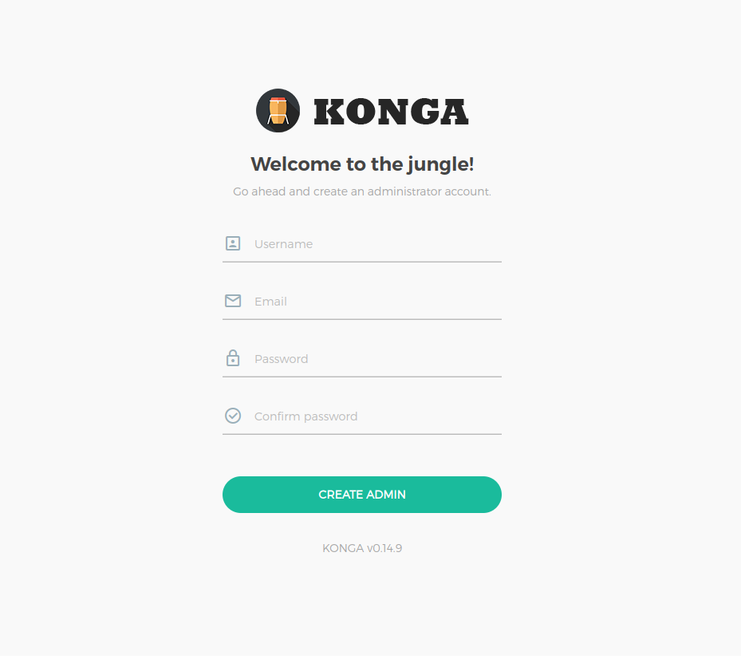
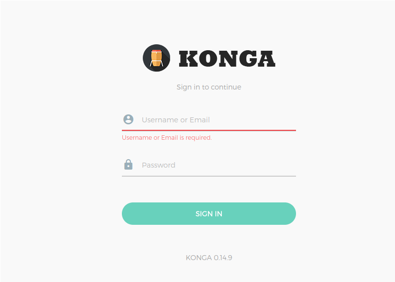
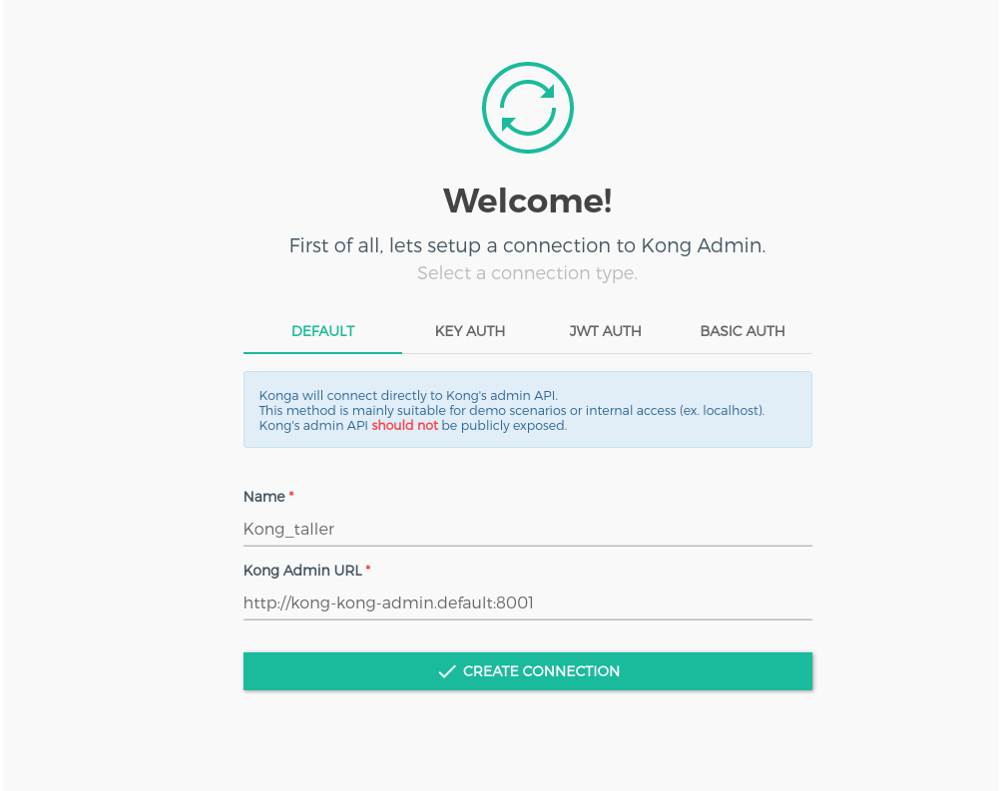
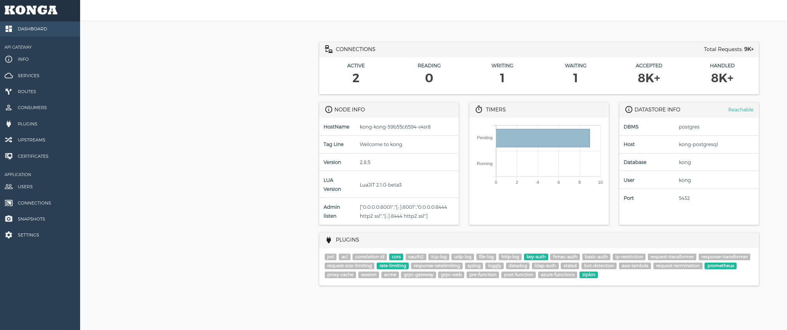

# Taller 1a - Instalación

**Objetivo:** Disponibilizar a nivel local Kong API Gateway con su respectiva interfaz de administración Konga

**Nota:** Independiente del sistema operativo recomendamos usar Rancher Desktop por sobre Docker Desktop. Los pasos de este taller están pensados para Windows. 

**Clonar repo**

```powershell
git clone https://github.com/bennu/kong_talleres.git
```

## **I. Levantamiento local de clúster Kubernetes (K8s) y herramientas necesarias para el taller**

La instalación de Rancher Desktop lo haremos por medio del gestor de paquetes [chocolatey](https://chocolatey.org/install#individual)

1. Descargar e instalar gestor de paquetes chocolatey para Windows. Para más información ver documentación [chocolatey](https://chocolatey.org/install#individual) 
    1.  Abrir PowerShell en modo administrador
    2.  Ejecutar el siguiente comando:
        
        ```powershell
        Set-ExecutionPolicy Bypass -Scope Process
        ```
        
    3.  Ejecutar el siguiente comando para instalar Chocolatey
        
        ```powershell
        Set-ExecutionPolicy Bypass -Scope Process -Force; [System.Net.ServicePointManager]::SecurityProtocol = [System.Net.ServicePointManager]::SecurityProtocol -bor 3072; iex ((New-Object System.Net.WebClient).DownloadString('https://community.chocolatey.org/install.ps1'))
        ```
        
    4.  Una vez completada la instalación, podemos verificarlo ejecutando
        
        ```powershell
        choco -?
        ```
        
        Resultado
        
        ```powershell
           .....
             --skipcompatibilitychecks, --skip-compatibility-checks
             SkipCompatibilityChecks - Prevent warnings being shown before and after
               command execution when a runtime compatibility problem is found between
               the version of Chocolatey and the Chocolatey Licensed Extension.
        
             --ignore-http-cache
             IgnoreHttpCache - Ignore any HTTP caches that have previously been
               created when querying sources, and create new caches. Available in 2.1.0+
        Chocolatey v2.3.0
        ```
        

2. Instalar Rancher Desktop usando el gestor de paquetes chocolatey para Windows: 

```powershell
choco install rancher-desktop -y
```

**Nota:** Rancher Desktop viene con las siguientes herramientas pre-instaladas:

- nerdctl
- kubectl
- Helm
- Docker cli

Si ya tiene instaladas algunas de las herramientas del listado, posiblemente se presenten conflictos de versiones.

3. Instalar deck (CLI de Kong)

```powershell
curl.exe -sL https://github.com/kong/deck/releases/download/v1.38.1/deck_1.38.1_windows_amd64.tar.gz -o deck.tar.gz
mkdir deck
tar -xf deck.tar.gz -C deck
powershell -command "[Environment]::SetEnvironmentVariable('Path', [Environment]::GetEnvironmentVariable('Path', 'User') + [IO.Path]::PathSeparator + [System.IO.Directory]::GetCurrentDirectory() + '\deck', 'User')"
```

## **II. Instalación de Kong 2.8 y Konga sobre Kubernetes**

### Kong 2.8

1. Agregar Helm chart de Kong

```powershell
helm repo update
helm repo add kong https://charts.konghq.com
```

2. Posicionarnos en el repositorio previamente clonado e instalar Kong versión 2.8 a través de Helm chart
   
```powershell
helm install kong kong/kong -f taller_1a/kong_2.8/values.yaml
```

3. Verificar que Kong se haya desplegado correctamente

```powershell
kubectl get pod --selector=app.kubernetes.io/instance=kong -w
```

```powershell

NAME                                  READY   STATUS      RESTARTS   AGE
pod/kong-postgresql-0                 1/1     Running     0          2m11s
pod/kong-kong-init-migrations-hsjhd   0/1     Completed   0          2m11s
pod/kong-kong-6547687c46-8cj4r        1/1     Running     0          2m11s
```

### Konga

1. Instalar interfaz de administración Konga

```powershell
kubectl apply -f taller_1a/konga/deployment.yaml
```

2. Verificar que el pod de Konga se está ejecutando correctamente

```powershell
kubectl get pods --selector=app=konga -w
```

3. Para acceder a la interfaz de Konga es necesario generar un port forward del servicio

```powershell
kubectl port-forward service/konga 8080:80
```

4. Acceder a la siguiente URL desde el navegador

```powershell
 http://localhost:8080
```

5. Se debe crear una cuenta de administración para utilizar Konga



6. Una vez creada la cuenta se debe iniciar sesión 



7. Conectar Kong Admin API con interfaz Konga

**Nota:** Se puede utilizar el DNS de K8s si está en el mismo clúster más el puerto que se expone el servicio, tal como se muestra en la siguiente URL:

```powershell
http://kong-kong-admin.default:8001
```



8. Podemos validar si se conectó correctamente al Admin API de Kong viendo el número de conexiones activas y la versión de Kong 


