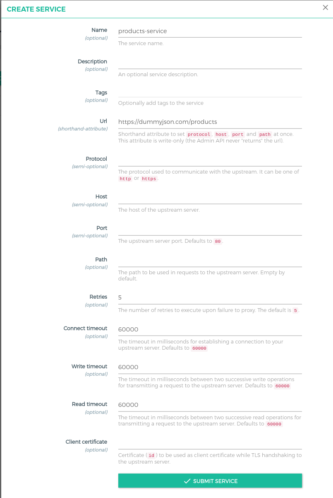

# Taller 1b - Administración

**Objetivo:** Crear entidades como Routes, Services, Plugins y Consumers usando distintas estrategias de administración (Konga, cURL y deck)

Para poder iniciar el taller se necesita exponer los siguientes servicios de manera local, exponiendo API Gateway y Admin API de Kong

**a) API Gateway**

```powershell
kubectl port-forward service/kong-kong-proxy 8000:80 
```

**b) Admin API**

```powershell
kubectl port-forward service/kong-kong-admin 8001:8001 
```

**c) Konga**

```powershell
kubectl port-forward service/konga 8080:80 
```

## I. Konga

En este ejemplo ocuparemos el API https://dummyjson.com/products, que es una API de desarrollo que muestra datos de prueba. Para esto se expondrá esta API desde la interfaz de Konga

### **A) Services**

1. Crearemos un services llamado **products-service**. Importante tener en cuenta los siguientes parámetros:

- **Name:  products-service**
- **URL:** Se ingresa el endpoint https://dummyjson.com/products para que se muestre desde Kong



### **B) Routes**

1. Una vez creado el services, podemos visualizar los detalles haciendo click sobre el nombre de este


2. Dentro del services **products-service**, nos dirigimos el apartado de **routes** y agregamos un nuevo **route**


Los valores que se deben considerar son los siguientes:

- **Name:** Corresponde al nombre que se le va a otorgar al route, en este caso los llamaremos **productos**
- **Paths:**  Aquí podemos definir distintos paths independiente de ello todos apuntan al mismo route. Importante que al momento de agregar nuevos paths se debe pulsar “ENTER” para agregarlos. En este caso agregaremos un solo path de nombre **“/productos”**


### **C) Plugins**

Una vez expuesto el API, es necesario definir como será consumido (tratamiento)

Lo primero que definiremos será el control del tráfico, limitando los orígenes de los que consumirán nuestro servicio ó API expuesto desde Kong y como estos se autenticarán. Para ello usaremos los plugins **rate-limit**, **Cors**, **key-auth** y **ACL**. Estos los agregaremos a nivel de la entidad **services** y se definirá un policy del tipo local para todos. 


### **- rate-limit:**

1. Nos dirigiremos al services **products-service**, luego seleccionamos la opción plugins, elegimos la categoría Traffic Control y seleccionamos el plugin **rate-limit**.  


Para efectos de prueba se deben configurar los siguientes parámetros:

- **minute:** 5 
- **limit by:** consumer
- **policy:** local


Podemos validar el comportamiento enviando 6 peticiones mediante cURL 

```bash
curl.exe -I http://localhost:8000/productos
#for _ in {1..6}; do {curl -I http://localhost:8000/productos; sleep 1;}  done
```

En la 6ª petición debería mostrarse el error 429 como código de estado, esto significa que llegó al límite definido de peticiones por minutos. 

### **- Cors**

1. Para agregarlo nos aseguramos de estar posicionados en el services **products-service**, seleccionamos la opción plugins y pulsamos el botón **ADD PLUGIN** 


2. Seleccionamos la categoría **Security** y el plugin llamado **Cors**


3. Los valores a considerar son los siguientes:

**origins:** Esta opción definirá los orígenes de las solicitudes entrantes que puede aceptar nuestro servicio ó API. Para esta prueba, definiremos asterisco como valor para que permita que puedan acceder desde cualquier origen. 

> Nota:  Para agregar valores al campo “origins” se debe presionar ENTER
> 


### **- key-auth**

1. Para agregar el plugin **key-auth** nos aseguraremos de estar en la entidad services **products-service**, nos dirigimos a la opción plugins y elegimos la categoría **Authentication**, tal como lo hicimos con el plugins **Cors**


2. Los valores a considerar son los siguientes:
 
- **key names:** corresponde al nombre de parámetro por el cual el cliente enviará un token asociado a uno de los consumers

**Ejemplo:** api-key = token asociado al consumers

Para este caso el campo key names, lo dejaremos vacío para que tome “**"apikey”** como nombre por defecto  


### **- ACL**

El plugin ACL (autorización) forma parte de la gestión de identidad y de acceso a un sistema. El ACL define el tipo de acceso para que se pueda acceder a un determinado servicio ó API. Por ejemplo, un consumer que tenga creado un API Key, que no pertenezca a un grupo de consumers y que intente acceder al services **products-service**, no le va a ser posible, puesto que la regla ACL está configurada para que solo permita la autorización a un grupo de consumers.

En este caso configuraremos el plugin ACL a nivel de **products-service** 


Importante tener en cuenta los siguientes parámetros:

- **allow:** admin (hace referencia a un grupo de consumers), en este caso se va a permitir solo al grupo admin 
- **deny:**  permite denegar el acceso a un grupo, tal como indica su nombre
- **hide groups header:**  determina si se envía el encabezado X-Consumer-Groups a servicio ascendente


### D) Consumers

Como definimos la manera de como se autenticarán a nuestro servicio ó API mediante key-auth, es necesario crear un consumer al que asociaremos un api-key para que autorice su acceso al services **products-service**

1. Crear un consumer de nombre **app**


2. Dentro del consumer **app**, nos dirigiremos a la opción Credentials y desde ahí creamos un api-key


3. Para este ejemplo dejaremos el campo key vacío para que Kong genere un valor aleatorio 


4. Se debe copiar el valor del api-key generado que se utilizará más adelante. 


> Nota: Para este ejemplo se agregará el consumer **app** al grupo consumers (**admin**) permitidos por el ACL
> 


5. Agregar consumer **app** a un grupo de consumers


6. El grupo de consumers se llama `admin`


7. Para confirmar que podemos acceder al servicio. Desde el navegador apuntamos la siguiente URL  **`http://localhost:8000/productos?apikey=<api key>`**, en ella se debiese mostrar un listado de productos en formato JSON tal como se observa en la imagen


## II. cURL

cURL es una herramienta de línea de comandos que interactuar con la Admin API de Kong, permitiendo realizar solicitudes HTTP.

1. Crear un nuevo route con nombre ***lista-productos*** asociado al service ***products-service** que sumará al route ***productos*** que creamos desde Konga

```powershell
curl.exe -i -X POST http://localhost:8001/services/products-service/routes `
     --data 'paths[]=/lista-productos' `
     --data name=products_route
```

Los parámetros a destacar en este ejemplo son:
- **paths:**  Contiene la  ruta por donde se va a exponer el servicio al consumidor
- **name:**  Nombre para identificar el route que se va crear

2. Restringir los métodos configurados de CORS a service products-service, limitándolos solo a GET y POST. Para esto se debe buscar el ID del plugin Cors asociado al servicio mediante un curl

```powershell
curl.exe -X GET http://localhost:8001/services/products-service/plugins
```

Deberíamos copiar el valor del key id relacionado al cors

Resultado de la ejecuccion comando curl
```powershell

{"data":[{"consumer":null,"name":"cors","id":"18e1cd4c-9774-40d7-9c7a-2ab8723ed568","config":{"credentials":false,"headers":null,"origins":["*"],"exposed_headers":null,"preflight_continue":false,"methods":["GET","HEAD","PUT","PATCH","POST","DELETE","OPTIONS","TRACE","CONNECT"],"
max_age":null},"tags":null,"created_at":1722556688,"service":{"id":"a1e24b40-82be-4a2d-9d9f-82499de97b7f"},"route":null,"protocols":["grpc","grpcs","http","https"],"enabled":true},{"consumer":null,"name":"rate-limiting","id":"1ad14c9b-dfeb-46d1-b9af-8c6199559e1a","config":{"poli
cy":"local","second":null,"minute":5,"hour":null,"day":null,"month":null,"year":null,"redis_username":null,"redis_password":null,"path":null,"redis_host":null,"redis_timeout":2000,"redis_ssl":false,"redis_ssl_verify":false,"redis_server_name":null,"redis_database":0,"header_name
":null,"redis_port":6379,"fault_tolerant":true,"hide_client_headers":false,"limit_by":"consumer"},"tags":null,"created_at":1722555798,"service":{"id":"a1e24b40-82be-4a2d-9d9f-82499de97b7f"},"route":null,"protocols":["grpc","grpcs","http","https"],"enabled":true},{"consumer":null
,"name":"acl","id":"36f14157-18a7-4c44-9995-f0e4d26a7eb4","config":{"deny":null,"allow":["admin"],"hide_groups_header":false},"tags":null,"created_at":1722559905,"service":{"id":"a1e24b40-82be-4a2d-9d9f-82499de97b7f"},"route":null,"protocols":["grpc","grpcs","http","https"],"ena
bled":true},{"consumer":null,"name":"key-auth","id":"882ca569-d1fa-499a-ba1c-1360f5d19f63","config":{"hide_credentials":false,"key_in_header":true,"key_in_query":true,"key_in_body":false,"run_on_preflight":true,"key_names":["apikey"],"anonymous":null},"tags":null,"created_at":17
22558099,"service":{"id":"a1e24b40-82be-4a2d-9d9f-82499de97b7f"},"route":null,"protocols":["grpc","grpcs","http","https"],"enabled":true}],"next":null}

```

Una vez copiado el ID, lo usamos para modificar las configuraciones CORS
```powershell
curl.exe -i -X PATCH `
--url http://localhost:8001/services/products-service/plugins/<plugin id> `
--data 'name=cors' `
--data 'config.origins=*' `
--data 'config.methods=GET' `
--data 'config.methods=POST' `
--data 'config.headers=Accept'  `
--data 'config.headers=Authorization'  `
--data 'config.headers=Content-Type'  `
--data 'config.credentials=true'  `
--data 'config.max_age=3600'
```

3. Modificar los parámetros del plugins rate-limit cambiando el numero maximo de consulta al servicio de 5 a 10 peticiones por minutos

```powershell
curl.exe -i -X PATCH `
  --url http://localhost:8001/services/products-service/plugins/<plugin id> `
  --data 'name=rate-limiting' `
  --data 'config.minute=10' `
  --data 'config.policy=local'
```

4. Podemos observar que la última petición arroja un código de estado **“429 too many request”**

```powershell
 for ($i=1; $i -le 11; $i++) {
     curl.exe -I http://localhost:8000/productos?apikey=<token>
     Start-Sleep -Seconds 1
 }
```

5. Configurar nuevo consumer con el nombre **dev** 

```powershell
curl.exe -i -X POST http://localhost:8001/consumers `
  --data username=dev
```

**Recordar que ya tenemos otro consumer de nombre **app**

6. Si creamos un API key sin ningún parámetro, este generará un valor aleatorio como token

```powershell
curl.exe -i -X POST http://localhost:8001/consumers/dev/key-auth
```

7. Otra alternativa , sería setear un valor en caso de ser necesario

```powershell
curl.exe -i -X POST http://localhost:8001/consumers/dev/key-auth  `
  --data key=top-secret-key
```

8. Agregar **consumer** a un grupo de consumers

```powershell
 curl.exe -X POST http://localhost:8001/consumers/dev/acls  `
    --data "group=dev"
```

9. En este caso, es importante considerar que el consumer dev no podrá acceder con su apikey para consumir el servicio **service-products** dado la regla ACL que solo otorga la autorización al grupo de consumers **admin**. Para esto agregaremos el consumer **dev** al grupo consumers **dev** al listado de consumers permitidos

```powershell
curl.exe -i -X PATCH `
--url http://localhost:8001/services/products-service/plugins/7b0bc880-d730-45af-ad79-9ea0d81bb245 `
--data 'name=acl' `
--data 'config.allow=admin' `
--data 'config.allow=dev' `
--data 'config.hide_groups_header=false' 
```

10. Podemos validar si podemos acceder ingresando de la siguiente forma  

```powershell
curl http://localhost:8000/productos?apikey=<apikey generado anteriormente>
```

## III. deck

1. Generar un dump de las configuraciones de Kong , se va crear un archivos llamado “kong.yaml”

```powershell
deck.exe dump         
```

2. Abrir archivos generado por dump y buscar el route productos


3. Cambiar path /productos por /products


4. Para aplicar los cambios, ejecutar el siguiente comando

```powershell
deck.exe sync
```

**Resultado**

```powershell
updating route productos  {
   "https_redirect_status_code": 426,
   "id": "373ca058-e0c4-4d3d-9380-97e65b605686",
   "name": "productos",
   "path_handling": "v1",
   "paths": [
-    "/productos"
+    "/products"
   ],
   "preserve_host": false,
   "protocols": [
     "http",
     "https"
   ],
   "regex_priority": 0,
   "request_buffering": true,
   "response_buffering": true,
   "service": {
     "id": "508d08e1-adf1-4e6a-8e07-0bcb18da5829",
     "name": "products-service"
   },
   "strip_path": true
 }

Summary:
  Created: 0
  Updated: 1
  Deleted: 0

```

5. Podemos validar el cambio ingresando a path /products

```powershell
curl.exe http://localhost:8000/products?apikey=<Token>
```
