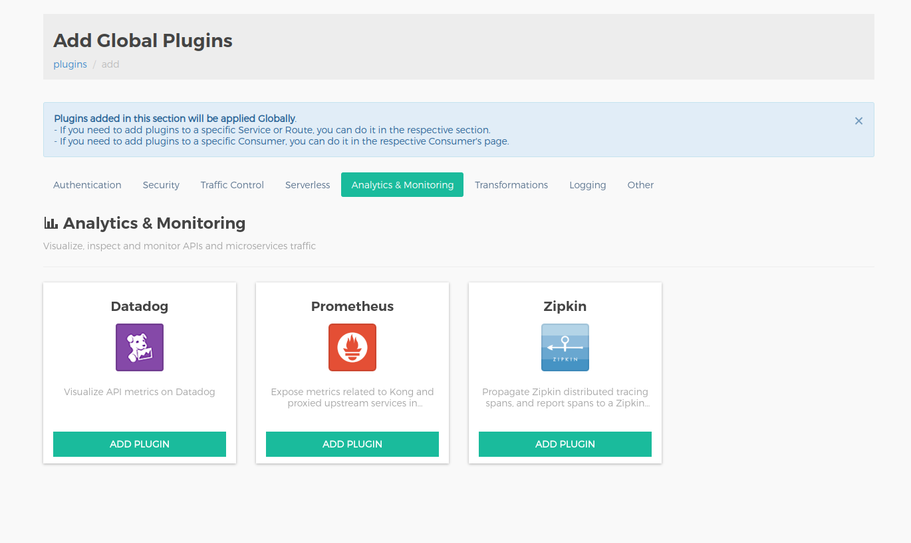
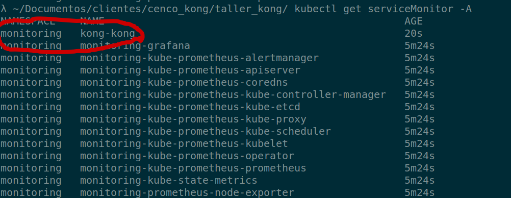
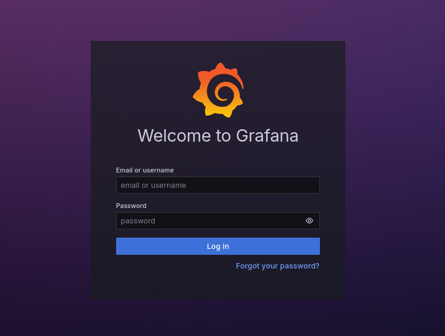
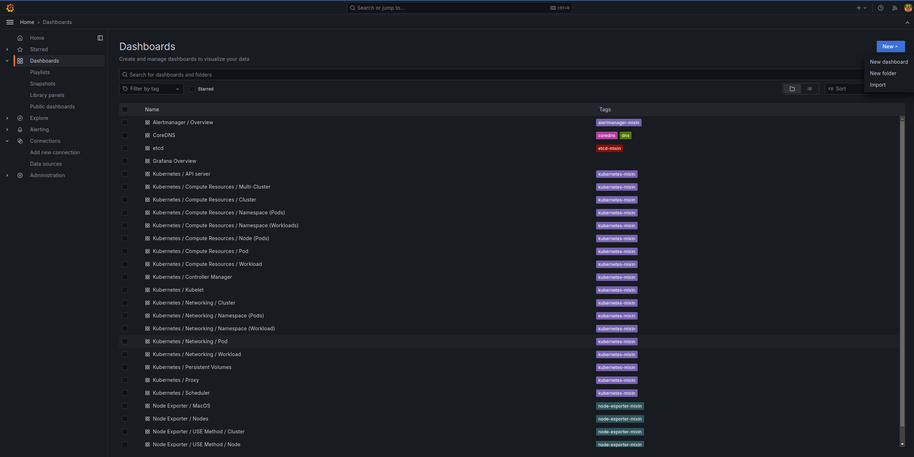
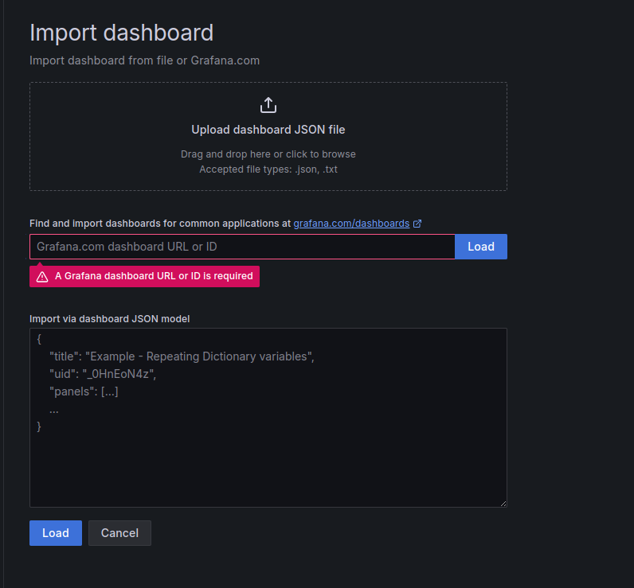
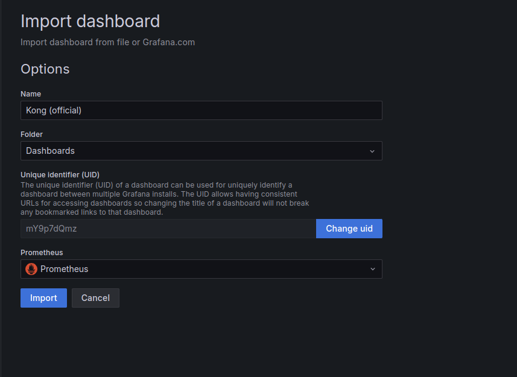

# Taller 2 - Observabilidad

objetivo: 

 

Para poder iniciar el taller se necesita exponer los siguientes servicios de manera local, exponiendo el API Gateway y Admin API de Kong

**a) API Gateway**

```bash
kubectl port-forward service/kong-kong-proxy 8000:80 &
```

**b) Admin API**

```bash
kubectl port-forward service/kong-kong-admin 8001:8001 &
```

**c) Konga**

```bash
kubectl port-forward service/konga 8080:80 &
```

Prometheus (métricas)

1. Instalación de plugins Prometheus

opción 1 -  configuración global mediante cURL

```jsx
curl -X POST http://localhost:8001/plugins/ \
    --header "accept: application/json" \
    --header "Content-Type: application/json" \
    --data '
    {
  "name": "prometheus",
  "config": {
    "per_consumer": true
  }
}
    '
```

opción 2 - instalación global  mediante interfaz Konga

el plugins se encuentra en la sección de análisis y monitoreo



**peer consumers**:  recopila si debe recopilar metricas por consumidor


Se puede verificar las metricas en el path /metrics del Kong Gateway 

```bash
curl http://localhost:8001/metrics
```

Resultado


Instalación de prometheus con grafana

agregar helm chart

```bash
helm repo add prometheus-community https://prometheus-community.github.io/helm-charts
helm repo update
```

Instalación de prometheus con grafana usando kube-prometheus-stack

```bash
helm install monitoring prometheus-community/kube-prometheus-stack --create-namespace --namespace monitoring -f taller_2/promethus_grafana/values.yaml
```

Creacion de service monitor mediante helm kong api gateway

```
helm upgrade kong kong/kong -f taller_2/promethus_grafana/kong_values.yaml
```

Verificar si el serviceMonitor relacionado a kong se creo

```
kubectl get serviceMonitor -A
```

En la imagen de abajo se puede visualizar que esta creado



exponer grafana de forma local

```
kubectl -n monitoring port-forward service/monitoring-grafana 8081:80 &
```

ingresar a [http://localhost:8081](http://localhost:8081) desde el navegador. 



Iniciar sesion con las siguiente credenciales:
**usuario: admin
password: prom-operator**

Importación de dashboard Kong Api Gateway

Se debe seleccionar la  seccion de dashboard  para luego presionar import 



Subir JSON que esta en el repo



Seleccionar promethues



Ver gráficos


Dentro de este gráficos las métricas a destacar son: 

Loggly (logs)

Creacion de cuenta en solarwings loggly

crear una cuenta [https://www.loggly.com/signup/](https://www.loggly.com/signup/)


Ir al sección de LOGS/Source Setup 


Luego Customer Tokens y copiar o crear un token


Implementan plugin loggly 

Se debe seleccionar la categoría Logging   y  agregar Loggly  


En  el campo key se debe agregar el consumer token vinculado a la cuenta de loggly, ademas podemos  dar un tags para identificar el trafico proveniente de Kong api gateway o entidad asociada al plugin . en este caso el Tags es “kong”. 


Para poder ver visualizar logs,  debemos generar trafico en el servicios creado en taller anterior, para ello podemos usar curl para enviar peticiones a nuestro servicio

```bash
for _ in {1..60}; do {curl -I http://localhost:8000/productos\?apikey=<Token>; sleep 1;}  done
```

Exploración de logging en consola de administración loggly 

Si vamos a la sección LOGS/Log explorer 


 

Se puede visualizar los logs en formato Json que tiene como origen el kong Api Gateway


[https://konghq.com/blog/learning-center/what-is-api-security](https://konghq.com/blog/learning-center/what-is-api-security)

dashboard  

ZIPKIN (tracing)

Instalación de zipkin

Las configuraciones necesario para el despligue del servidor zipkin se encuentra  dentro del archivo deployment.yaml 

```bash
kubectl apply -f sesion_3_monitoreo/zipkin/deployment.yaml
```

exponer gui zipkin

```bash
kubectl port-forward service/zipkin  9411:80 &
```

La interfaz de zipkin se puede acceder a traves de http:/localhost:9411

Instalación de plugins Zipkin

```powershell
curl -X POST http://localhost:8001/plugins/ \
   --header "accept: application/json" \https://konghq.com/blog/learning-center/what-is-api-security
   --header "Content-Type: application/json" \
   --data '
   {
 "name": "zipkin",
 "config": {
   "http_endpoint": "http://zipkin.default/api/v2/spans",
   "sample_ratio": 1,
   "include_credential": true
 }
}
   '
```

generar trafico 

```bash
for _ in {1..60}; do {curl -I http://localhost:8000/productos\?apikey\=DREUQDmOxUDRP3I6j2KJYPhQO09bp4Mx; sleep 1;}  done
```

Resultado

